# Code generation

Copy Page

Writing, reviewing, editing, and answering questions about code is one of the primary use cases for OpenAI models today. This guide walks through your options for code generation with [`gpt-5.6`](../models/gpt-5.md) and Codex.

## Get started

[

Use Codex for out-of-the-box coding agents

Connect your codebase to Codex and accelerate your projects using software engineering agents.](#use-codex)[

Integrate with coding models

Use OpenAI models in your application. Add them to a model picker, for instance.](#integrate-with-coding-models)

## Use Codex

[**Codex**](/codex/overview) is OpenAI’s coding agent for software development. It helps you write, review and debug code. Interact with Codex in a variety of interfaces: in your IDE, through the CLI, on web and mobile sites, or in your CI/CD pipelines with the SDK. Codex is the best way to get agentic software engineering on your projects.

Codex works best with the latest models from the GPT-5 family, such as [`gpt-5.6`](../models/gpt-5.md). We offer a range of models specifically designed to work with coding agents like Codex, such as [`gpt-5.3-codex`](../models/gpt-5.md), but we recommend using the latest general-purpose model for most code generation tasks.

See the [ChatGPT docs](https://developers.openai.com/codex) for setup guides, reference material, pricing, and more information.

## Integrate with coding models

For most API-based code generation, start with **`gpt-5.6`**. It handles both general-purpose work and coding, which makes it a strong default when your application needs to write code, reason about requirements, inspect docs, and handle broader workflows in one place.

This example shows how you can use the [Responses API](../api-reference/responses.md) for a code generation use case:

Default model for most coding tasks

python

```
1
2
3
4
5
6
7
8
9
10
11
12
13
14
15
16
import OpenAI from "openai";
const openai = new OpenAI();

const result = await openai.responses.create({
  model: "gpt-5.6",
  input: `Find the null pointer exception in this code:

def display_name(user):
    return user.profile.name

print(display_name(None))
`,
  reasoning: { effort: "high" },
});

console.log(result.output_text);
```

```
1
2
3
4
5
6
7
8
9
10
11
12
13
14
15
16
17
from openai import OpenAI

client = OpenAI()

result = client.responses.create(
    model="gpt-5.6",
    input="""Find the null pointer exception in this code:

def display_name(user):
    return user.profile.name

print(display_name(None))
""",
    reasoning={"effort": "high"},
)

print(result.output_text)
```

```
1
2
3
4
5
6
7
8
curl https://api.openai.com/v1/responses \
  -H "Content-Type: application/json" \
  -H "Authorization: Bearer $OPENAI_API_KEY" \
  -d '{
    "model": "gpt-5.6",
    "input": "Find the null pointer exception in this code:\n\ndef display_name(user):\n    return user.profile.name\n\nprint(display_name(None))\n",
    "reasoning": { "effort": "high" }
  }'
```

## Frontend development

Our models from the GPT-5 family are especially strong at frontend development, especially when combined with a coding agent harness such as Codex.

The demo applications below were one shot generations, i.e. generated from a single prompt without hand-written code. Use them to evaluate frontend generation quality and prompt patterns for UI-heavy code generation workflows.

Explore

[](#)[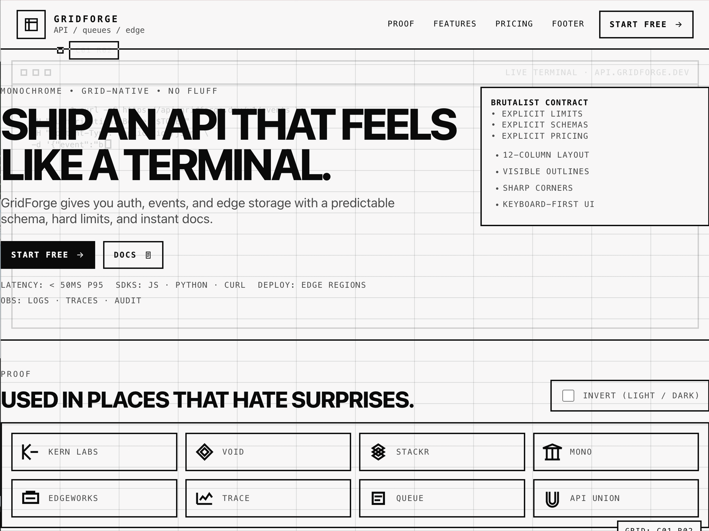](#)[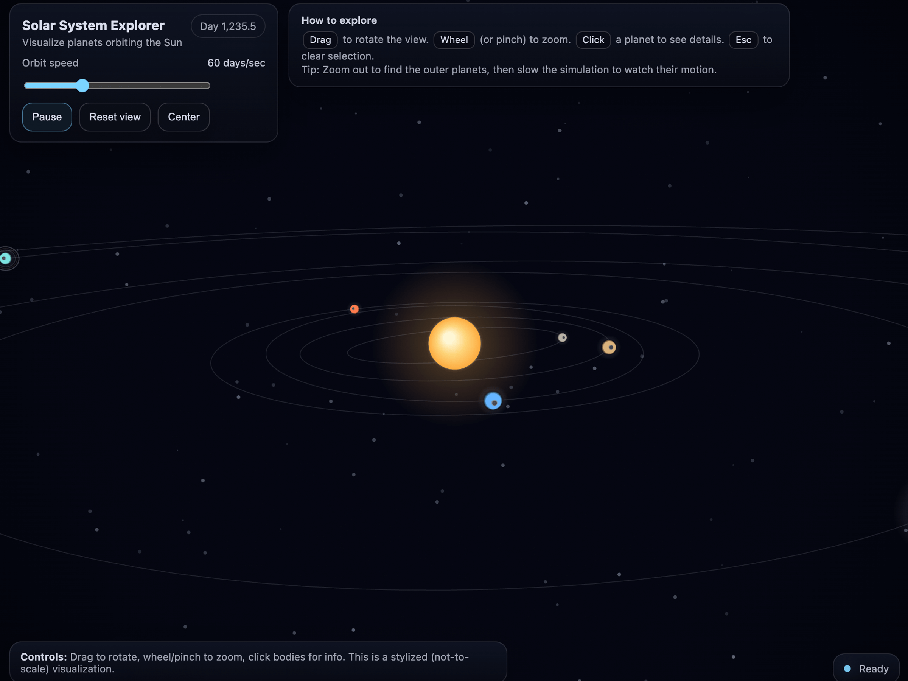](#)[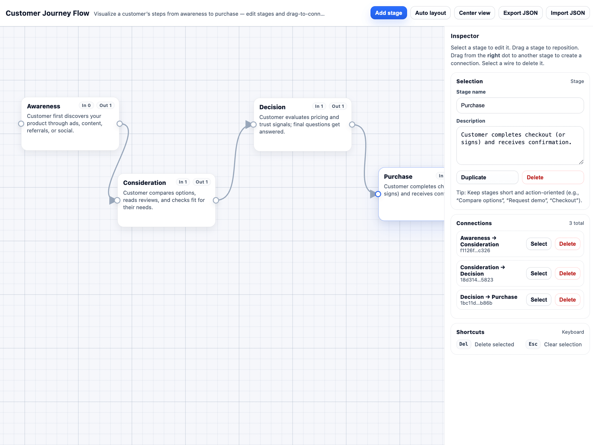](#)[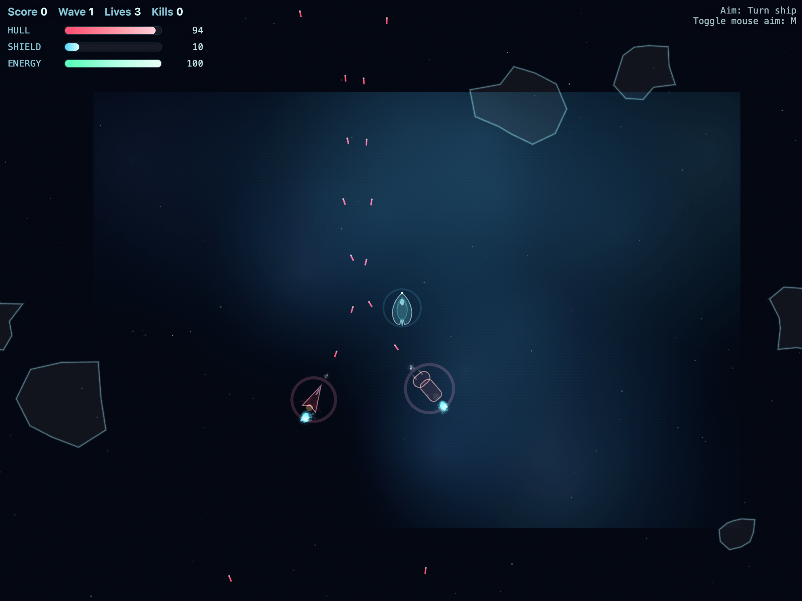](#)[](#)[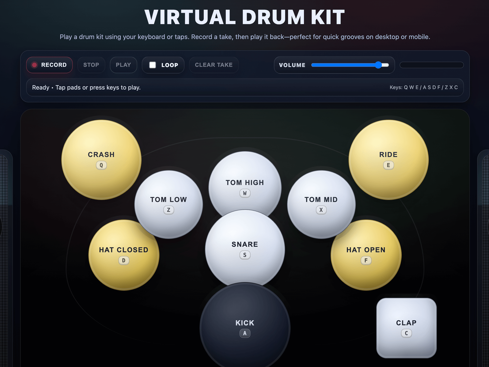](#)[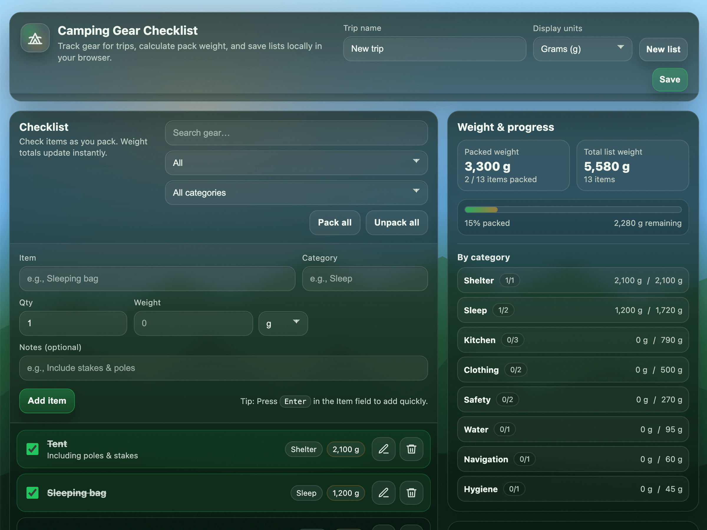](#)[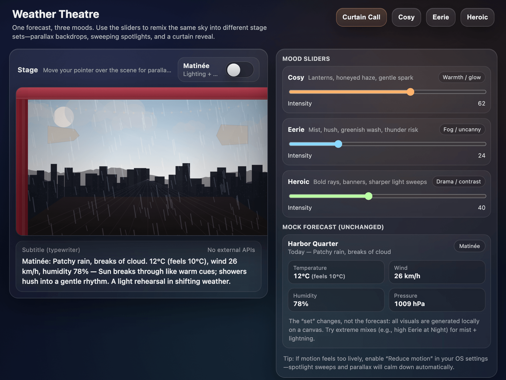](#)[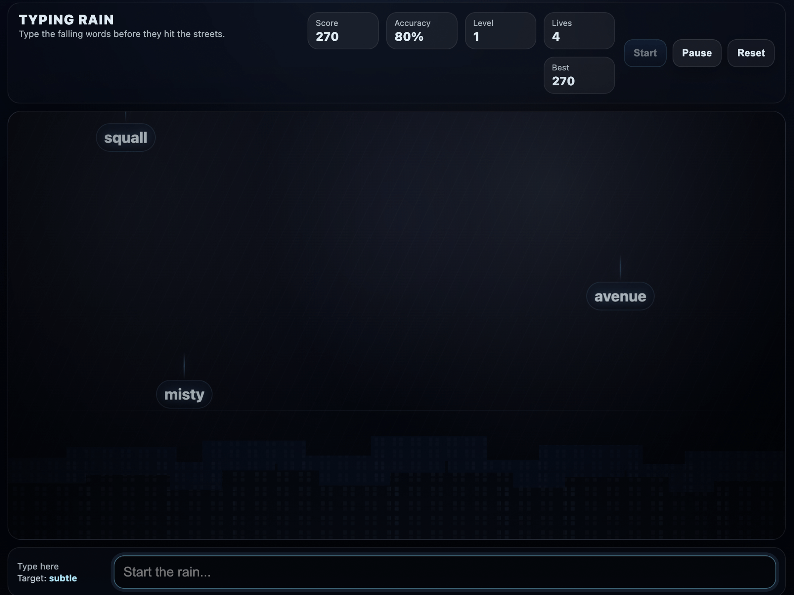](#)[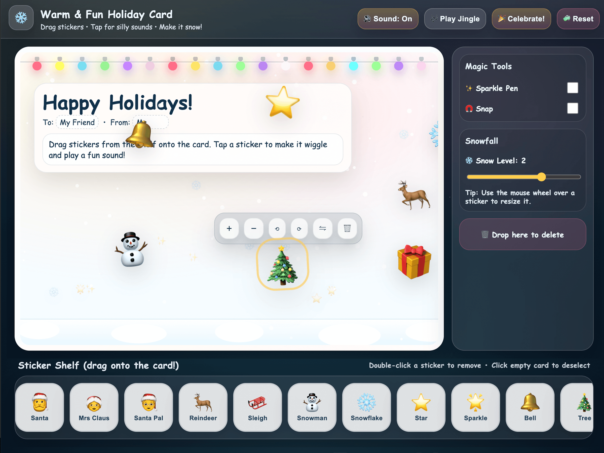](#)[](#)[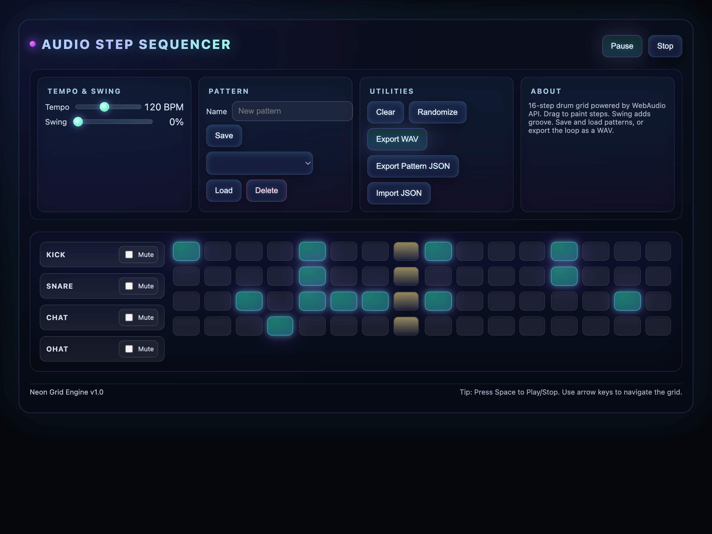](#)[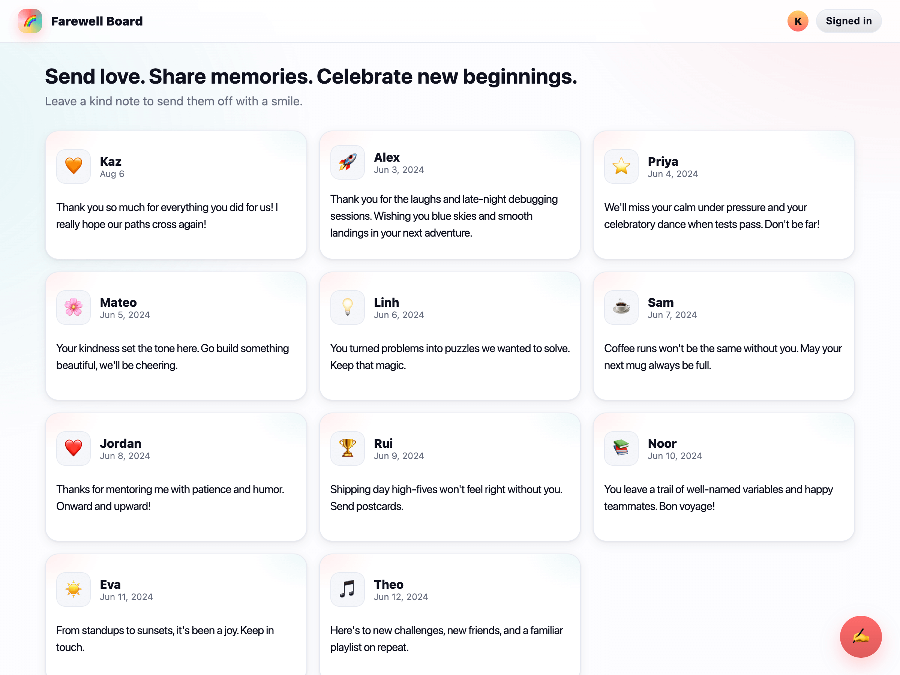](#)[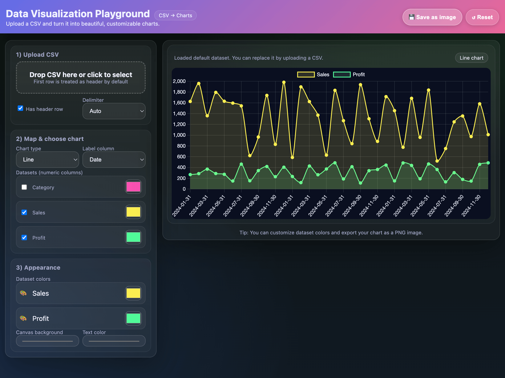](#)[](#)

## Next steps

- Visit the [ChatGPT docs](https://developers.openai.com/codex) to learn what you can do with Codex, set up Codex in whichever interface you choose, or find more details.
- Read [Model guidance](latest-model.md) for model selection, features, migration guidance, and prompting patterns that work well on coding and agentic tasks.
- Compare [`gpt-5.6`](../models/gpt-5.md) and [`gpt-5.3-codex`](../models/gpt-5.md) on the model pages.