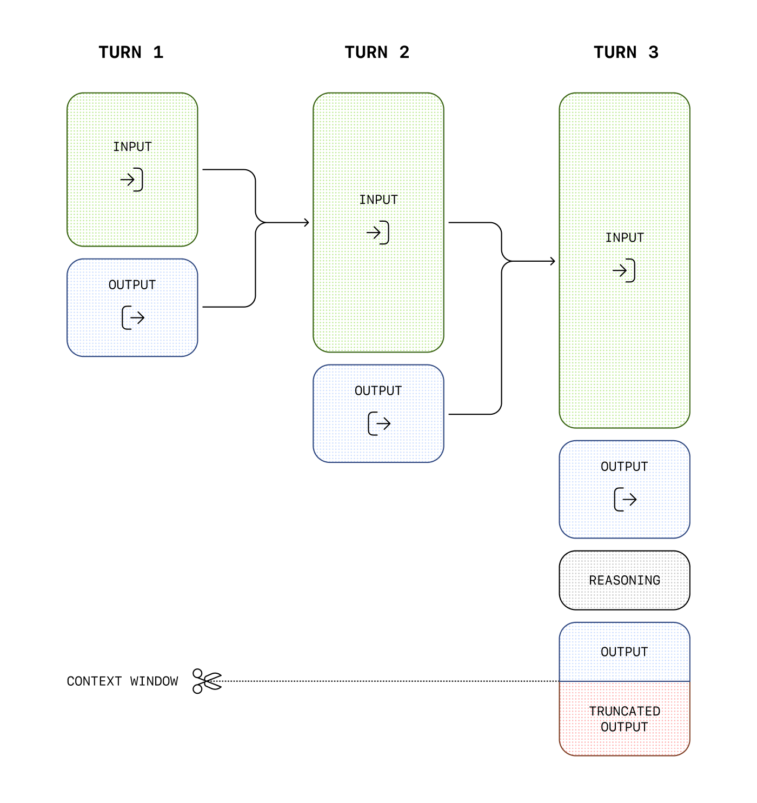

# Conversation state

Responses

Copy Page

Responses

OpenAI provides a few ways to manage conversation state, which is important for preserving information across multiple messages or turns in a conversation.

When troubleshooting cases where GPT-5.5 treats an intermediate update as
the final answer, verify your integration preserves the assistant message
`phase` field correctly. See [Phase
parameter](reasoning.md) for details.

## Manually manage conversation state

While each text generation request is independent and stateless, you can still implement **multi-turn conversations** by providing additional messages as parameters to your text generation request. Consider a knock-knock joke:

Manually construct a past conversation

python

```
1
2
3
4
5
6
7
8
9
10
11
12
13
14
15
16
17
18
19
20
21
22
23
import OpenAI from "openai";

const openai = new OpenAI();

const response = await openai.chat.completions.create({
  model: "gpt-5.6",
  messages: [
    {
      role: "user",
      content: "knock knock.",
    },
    {
      role: "assistant",
      content: "Who's there?",
    },
    {
      role: "user",
      content: "Orange.",
    },
  ],
});

console.log(response.choices[0].message.content);
```

```
1
2
3
4
5
6
7
8
9
10
11
12
13
14
from openai import OpenAI

client = OpenAI()

response = client.chat.completions.create(
    model="gpt-5.6",
    messages=[
        {"role": "user", "content": "knock knock."},
        {"role": "assistant", "content": "Who's there?"},
        {"role": "user", "content": "Orange."},
    ],
)

print(response.choices[0].message.content)
```

Manually construct a past conversation

python

```
1
2
3
4
5
6
7
8
9
10
11
12
13
14
import OpenAI from "openai";

const openai = new OpenAI();

const response = await openai.responses.create({
  model: "gpt-5.6",
  input: [
    { role: "user", content: "knock knock." },
    { role: "assistant", content: "Who's there?" },
    { role: "user", content: "Orange." },
  ],
});

console.log(response.output_text);
```

```
1
2
3
4
5
6
7
8
9
10
11
12
13
14
from openai import OpenAI

client = OpenAI()

response = client.responses.create(
    model="gpt-5.6",
    input=[
        {"role": "user", "content": "knock knock."},
        {"role": "assistant", "content": "Who's there?"},
        {"role": "user", "content": "Orange."},
    ],
)

print(response.output_text)
```

By using alternating `user` and `assistant` messages, you capture the previous state of a conversation in one request to the model.

To manually share context across generated responses, include the model’s previous response output as input, and append that input to your next request.

For stateless reasoning-model requests, preserve every item in the response’s `output` array. The Responses API returns encrypted reasoning items by default. Replaying the complete output keeps reasoning items and assistant `phase` values intact. Models that support persisted reasoning can use `reasoning.context: "all_turns"` to render the available reasoning from earlier turns into the next sample. See [preserve reasoning across calls](reasoning.md).

In the following example, we ask the model to tell a joke, followed by a request for another joke. Appending previous responses to new requests in this way helps ensure conversations feel natural and retain the context of previous interactions.

Manually manage conversation state with the Chat Completions API.

python

```
1
2
3
4
5
6
7
8
9
10
11
12
13
14
15
16
17
18
19
20
21
22
23
24
25
26
27
28
29
30
31
import OpenAI from "openai";

const openai = new OpenAI();

/** @type {OpenAI.ChatCompletionMessageParam[]} */
let history = [
  {
    role: "user",
    content: "tell me a joke",
  },
];

const completion = await openai.chat.completions.create({
  model: "gpt-5.6",
  messages: history,
});

console.log(completion.choices[0].message.content);

history.push(completion.choices[0].message);
history.push({
  role: "user",
  content: "tell me another",
});

const secondCompletion = await openai.chat.completions.create({
  model: "gpt-5.6",
  messages: history,
});

console.log(secondCompletion.choices[0].message.content);
```

```
1
2
3
4
5
6
7
8
9
10
11
12
13
14
15
16
17
18
19
20
21
22
from openai import OpenAI

client = OpenAI()

history = [{"role": "user", "content": "tell me a joke"}]

response = client.chat.completions.create(
    model="gpt-5.6",
    messages=history,
)

print(response.choices[0].message.content)

history.append(response.choices[0].message)
history.append({"role": "user", "content": "tell me another"})

second_response = client.chat.completions.create(
    model="gpt-5.6",
    messages=history,
)

print(second_response.choices[0].message.content)
```

Manually manage conversation state with the Responses API.

python

```
1
2
3
4
5
6
7
8
9
10
11
12
13
14
15
16
17
18
19
20
21
22
23
24
25
26
27
28
29
30
31
32
33
34
35
import OpenAI from "openai";

const openai = new OpenAI();

/** @type {OpenAI.Responses.ResponseInput} */
let history = [
  {
    role: "user",
    content: "tell me a joke",
  },
];

const response = await openai.responses.create({
  model: "gpt-5.6",
  input: history,
  store: false,
});

console.log(response.output_text);

// Add all response output items, including reasoning items, to the history
history.push(...response.output);

history.push({
  role: "user",
  content: "tell me another",
});

const secondResponse = await openai.responses.create({
  model: "gpt-5.6",
  input: history,
  store: false,
});

console.log(secondResponse.output_text);
```

```
1
2
3
4
5
6
7
8
9
10
11
12
13
14
15
16
17
18
19
20
21
22
23
24
25
26
from openai import OpenAI

client = OpenAI()

history = [{"role": "user", "content": "tell me a joke"}]

response = client.responses.create(
    model="gpt-5.6",
    input=history,
    store=False,
)

print(response.output_text)

# Add all response output items, including encrypted reasoning items, to the conversation
history += response.output

history.append({"role": "user", "content": "tell me another"})

second_response = client.responses.create(
    model="gpt-5.6",
    input=history,
    store=False,
)

print(second_response.output_text)
```

## OpenAI APIs for conversation state

Our APIs make it easier to manage conversation state automatically, so you don’t have to pass inputs manually with each turn of a conversation.

We recommend using the [Responses API](conversation-state.md) instead. Because it’s stateful, managing context across conversations is a simple parameter.

If you’re using the Chat Completions endpoint, you’ll need to either manually manage state, as documented above.

### Using the Conversations API

The [Conversations API](../api-reference/conversations/create.md) works with the [Responses API](../api-reference/responses/create.md) to persist conversation state as a long-running object with its own durable identifier. After creating a conversation object, you can keep using it across sessions, devices, or jobs.

Conversations store items, which can be messages, tool calls, tool outputs, and other data.

Create a conversation

python

```
conversation = openai.conversations.create()
```

In a multi-turn interaction, you can pass the `conversation` into subsequent responses to persist state and share context across subsequent responses, rather than having to chain multiple response items together.

Manage conversation state with Conversations and Responses APIs

python

```
1
2
3
4
5
response = openai.responses.create(
    model="gpt-5.6",
    input=[{"role": "user", "content": "What are the 5 Ds of dodgeball?"}],
    conversation=conversation.id,
)
```

### Passing context from the previous response

Another way to manage conversation state is to share context across generated responses with the `previous_response_id` parameter. This parameter lets you chain responses and create a threaded conversation.

Chain responses across turns by passing the previous response ID

python

```
1
2
3
4
5
6
7
8
9
10
11
12
13
14
15
16
17
18
19
20
import OpenAI from "openai";

const openai = new OpenAI();

const response = await openai.responses.create({
  model: "gpt-5.6",
  input: "tell me a joke",
  store: true,
});

console.log(response.output_text);

const secondResponse = await openai.responses.create({
  model: "gpt-5.6",
  previous_response_id: response.id,
  input: [{ role: "user", content: "explain why this is funny." }],
  store: true,
});

console.log(secondResponse.output_text);
```

```
1
2
3
4
5
6
7
8
9
10
11
12
13
14
15
16
from openai import OpenAI

client = OpenAI()

response = client.responses.create(
    model="gpt-5.6",
    input="tell me a joke",
)
print(response.output_text)

second_response = client.responses.create(
    model="gpt-5.6",
    previous_response_id=response.id,
    input=[{"role": "user", "content": "explain why this is funny."}],
)
print(second_response.output_text)
```

In the following example, we ask the model to tell a joke. Separately, we ask the model to explain why it’s funny, and the model has all necessary context to deliver a good response.

Manually manage conversation state with the Responses API

python

```
1
2
3
4
5
6
7
8
9
10
11
12
13
14
15
16
17
18
19
20
import OpenAI from "openai";

const openai = new OpenAI();

const response = await openai.responses.create({
  model: "gpt-5.6",
  input: "tell me a joke",
  store: true,
});

console.log(response.output_text);

const secondResponse = await openai.responses.create({
  model: "gpt-5.6",
  previous_response_id: response.id,
  input: [{ role: "user", content: "explain why this is funny." }],
  store: true,
});

console.log(secondResponse.output_text);
```

```
1
2
3
4
5
6
7
8
9
10
11
12
13
14
15
16
from openai import OpenAI

client = OpenAI()

response = client.responses.create(
    model="gpt-5.6",
    input="tell me a joke",
)
print(response.output_text)

second_response = client.responses.create(
    model="gpt-5.6",
    previous_response_id=response.id,
    input=[{"role": "user", "content": "explain why this is funny."}],
)
print(second_response.output_text)
```

#### `previous_response_id` in WebSocket mode

If you are using [the Responses API WebSocket mode](websocket-mode.md), continuation uses the same `previous_response_id` semantics as HTTP mode, but over a persistent socket with repeated `response.create` events.

The connection-local cache currently keeps the most recent previous response in memory for low-latency continuation. If an uncached ID cannot be resolved, send a new turn with `previous_response_id` set to `null` and pass full input context.

Data retention for model responses

Response objects are saved for 30 days by default. They can be viewed in the dashboard
[logs](https://platform.openai.com/logs?api=responses) page or
[retrieved](../api-reference/responses/get.md) via the API.
You can disable this behavior by setting `store` to `false`
when creating a Response.

Conversation objects and items in them are not subject to the 30 day TTL. Any response attached to a conversation will have its items persisted with no 30 day TTL.

OpenAI does not use data sent via API to train our models without your explicit consent—[learn more](your-data.md).

Even when using `previous_response_id`, all previous input tokens for responses in the chain are billed as input tokens in the API.

## Managing the context window

Understanding context windows will help you successfully create threaded conversations and manage state across model interactions.

The **context window** is the maximum number of tokens that can be used in a single request. This max tokens number includes input, output, and reasoning tokens. To learn your model’s context window, see [model details](../models.md).

### Managing context for text generation

As your inputs become more complex, or you include more turns in a conversation, you’ll need to consider both **output token** and **context window** limits. Model inputs and outputs are metered in [**tokens**](https://help.openai.com/en/articles/4936856-what-are-tokens-and-how-to-count-them), which are parsed from inputs to analyze their content and intent and assembled to render logical outputs. Models have limits on token usage during the lifecycle of a text generation request.

- **Output tokens** are the tokens generated by a model in response to a prompt. Each model has different [limits for output tokens](../models.md). For example, `gpt-4o-2024-08-06` can generate a maximum of 16,384 output tokens.
- A **context window** describes the total tokens that can be used for both input and output tokens (and for some models, [reasoning tokens](reasoning.md)). Compare the [context window limits](../models.md) of our models. For example, `gpt-4o-2024-08-06` has a total context window of 128k tokens.

If you create a large prompt—often by including extra context, data, or examples for the model—you run the risk of exceeding the allocated context window for a model, which might result in truncated outputs.

Use the [tokenizer tool](https://platform.openai.com/tokenizer), built with the [tiktoken library](https://github.com/openai/tiktoken), to see how many tokens are in a particular string of text.

For example, when making an API request to [Chat Completions](../api-reference/chat.md) with the [o1 model](reasoning.md), the following token counts will apply toward the context window total:

- Input tokens (inputs you include in the `messages` array with [Chat Completions](../api-reference/chat.md))
- Output tokens (tokens generated in response to your prompt)
- Reasoning tokens (used by the model to plan a response)

For example, when making an API request to the [Responses API](../api-reference/responses.md) with a reasoning enabled model, like the [o1 model](reasoning.md), the following token counts will apply toward the context window total:

- Input tokens (inputs you include in the `input` array for the [Responses API](../api-reference/responses.md))
- Output tokens (tokens generated in response to your prompt)
- Reasoning tokens (used by the model to plan a response)

Tokens generated in excess of the context window limit may be truncated in API responses.



You can estimate the number of tokens your messages will use with the [tokenizer tool](https://platform.openai.com/tokenizer).

### Compaction

Detailed compaction guidance now lives in
[Compaction](compaction.md).

- For `/responses` with `context_management` and `compact_threshold`, see
  [Server-side compaction](compaction.md).
- For explicit compaction control, see
  [Standalone compact endpoint](compaction.md)
  and the [`/responses/compact` API reference](../api-reference/responses/compact.md).

## Next steps

For more specific examples and use cases, visit the [OpenAI Cookbook](/cookbook), or learn more about using the APIs to extend model capabilities:

- [Receive JSON responses with Structured Outputs](structured-outputs.md)
- [Extend the models with function calling](function-calling.md)
- [Enable streaming for real-time responses](streaming-responses.md)
- [Build a computer-using agent](tools-computer-use.md)