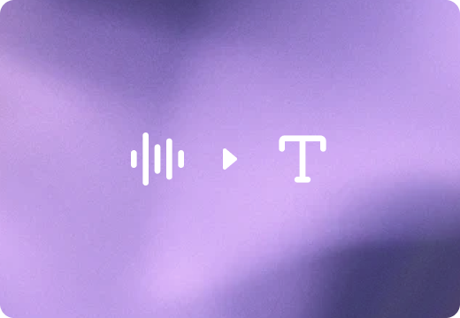
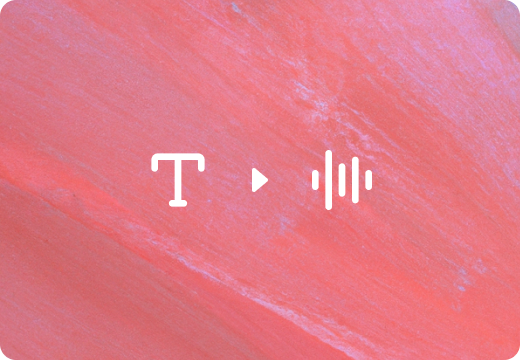

# Realtime and audio

Copy Page

[Build voice agents

Build voice agents in the browser.](voice-agents.md)

Start with the outcome you want to build. Realtime sessions are best for live audio that needs low latency. Request-based audio APIs are best for files, bounded requests, or generated speech that doesn’t need a live session.

## Common use cases

[

Voice agents

Build speech-to-speech agents that listen, reason, speak, and call tools.](voice-agents.md)[

Live translation

Translate live speech with a dedicated realtime translation session.](realtime-translation.md)[

Transcription

Stream live transcript deltas or process audio files into text.](realtime-transcription.md)[

Speech generation

Turn text into natural-sounding spoken audio.](text-to-speech.md)

## Understand different architectures

| Goal | Model or API | Start here |
| --- | --- | --- |
| Build a low-latency voice agent | [`gpt-realtime-2.1`](../models/gpt-realtime-2.md) | [Voice agents](voice-agents.md) |
| Translate live speech into another language | [`gpt-realtime-translate`](../models/gpt-realtime-translate.md) | [Realtime translation](realtime-translation.md) |
| Transcribe live audio into streaming text | [`gpt-realtime-whisper`](../models/gpt-realtime-whisper.md) | [Realtime transcription](realtime-transcription.md) |
| Transcribe files or bounded audio requests | Audio transcription models | [Speech to text](speech-to-text.md) |
| Generate speech from text | Speech generation models | [Text to speech](text-to-speech.md) |
| Add audio to an existing Chat Completions app | Audio-capable chat models | [Audio and speech](audio.md) |

## Choose a realtime session

Realtime sessions keep a connection open while your application sends audio, receives events, and updates session state.

| Session type | Use when | Endpoint or pattern |
| --- | --- | --- |
| Voice-agent session | The model should respond to the user, call tools, and manage conversation state. | Conversation session on `/v1/realtime` |
| Translation session | The app should continuously translate speech as it arrives. | Continuous translation session on `/v1/realtime/translations` |
| Transcription session | The app needs streaming transcript deltas without model-generated spoken responses. | Transcription session that emits transcript deltas |

Use a voice-agent session when your application needs an assistant that responds to the user. Use a translation session when your application needs an interpreter that translates the speaker. Use a transcription session when your application needs text from audio without model-generated responses.

### Voice-agent sessions

Voice-agent sessions use the standard Realtime API conversation lifecycle. The client connects to `/v1/realtime`, sends audio or text, and listens for model responses, tool calls, and session events.

For most browser voice agents, start with the [Voice agents](voice-agents.md) guide. It uses the Agents SDK with WebRTC for browser audio and can connect to server-side tools.

Realtime 2 adds reasoning to speech-to-speech workflows. Start with
`reasoning.effort` set to `low` for most production voice agents, then adjust
based on latency tolerance and task complexity. Use the [Realtime prompting
guide](realtime-models-prompting.md) to tune reasoning,
preambles, tool use, unclear audio, and exact entity capture.

### Translation sessions

Realtime translation uses a dedicated translation endpoint instead of the standard voice-agent endpoint. Translation sessions are continuous: the client streams audio into the session, and the service streams translated audio and transcript deltas out.

Translation sessions don’t use the normal assistant turn lifecycle. Don’t call `response.create`, and don’t wait for the client to commit a user turn before translation begins. For browser media, use WebRTC. For server media pipelines such as phone calls or broadcast ingest, use WebSockets.

See [Realtime translation](realtime-translation.md) for the dedicated endpoint, session configuration, and architecture patterns.

### Transcription sessions

You can transcribe audio in more than one way. Use a realtime transcription session when your application needs live transcript deltas from streaming audio. Use the [Speech to text](speech-to-text.md) guide for file uploads, request-based transcription, or diarization-focused workflows.

For realtime transcription, [`gpt-realtime-whisper`](../models/gpt-realtime-whisper.md) gives you controllable latency. Lower delay settings produce earlier partial text, while higher delay settings can improve transcript quality. Test with your real audio conditions, target languages, accents, and domain vocabulary before choosing a production default.

See [Realtime transcription](realtime-transcription.md) for session configuration and event handling.

## Choose a connection method

Choose the transport based on where your application captures and plays audio:

[WebRTC

Use for browser and mobile clients that capture or play audio directly.](realtime-webrtc.md)
[WebSocket

Use when your server already receives raw audio from a media pipeline, call
system, or worker.](realtime-websocket.md)
[SIP

Use for telephony voice agents. Confirm model support before using SIP for
translation or transcription.](realtime-sip.md)

## Safety identifiers

If your application identifies individual end users, include a [safety identifier](safety-best-practices.md) with Realtime API requests. Safety identifiers are recommended but not required. They help OpenAI monitor and detect abuse while allowing enforcement to target an individual user rather than your entire organization. Use a stable, privacy-preserving value, such as a hashed internal user ID.

For Realtime API requests, send the identifier in the `OpenAI-Safety-Identifier` header. When using ephemeral tokens, set the header on the server-side request that creates the client secret so the identifier is bound to that session. When connecting from a trusted server with WebSocket or the unified WebRTC interface, set the header on the connection request.

Safety identifiers do not carry over from Responses API requests or from other sessions. If you use the Responses API `safety_identifier` parameter elsewhere in your application, pass the same stable value separately when you create or connect each Realtime session.

## Beta to GA migration

If you still have a beta Realtime integration, migrate it to the GA interface before moving forward with new work. The most important changes are:

- Remove the `OpenAI-Beta: realtime=v1` header when calling the GA interface.
- Use [`POST /v1/realtime/client_secrets`](../api-reference/realtime-sessions/create-realtime-client-secret.md) to create ephemeral credentials for browser or mobile clients.
- Use `/v1/realtime/calls` when establishing WebRTC sessions.
- Update session and event shapes for the GA interface. In particular, set `session.type`, move output audio configuration under `session.audio.output`, and use the newer response event names like `response.output_text.delta`, `response.output_audio.delta`, and `response.output_audio_transcript.delta`.
- If you are moving a speech-to-speech app forward, start from the [Voice agents](voice-agents.md) guide. If you are moving a transcription workflow forward, use [Realtime transcription](realtime-transcription.md).

See the [Realtime client events reference](../api-reference/realtime_client_events.md), [Realtime sessions reference](../api-reference/realtime-sessions.md), and [Voice agents](voice-agents.md) guide for the current GA flow.

## Related guides

- [Realtime prompting guide](realtime-models-prompting.md): Prompt and tune Realtime voice models.
- [Managing conversations](realtime-conversations.md): Work with the Realtime session lifecycle.
- [Realtime translation](realtime-translation.md): Translate live speech with a dedicated translation session.
- [Realtime transcription](realtime-transcription.md): Stream live transcript deltas from audio.
- [Realtime with tools](realtime-mcp.md): Connect function tools, MCP servers, and connectors to a Realtime session.
- [Webhooks and server-side controls](realtime-server-controls.md): Control Realtime sessions from your server.
- [Managing costs](realtime-costs.md): Track and optimize Realtime API usage.

Use [Audio and speech](audio.md) for the core concepts behind
audio input, audio output, streaming, latency, transcripts, and speech
generation. Use this overview when you are ready to choose an implementation
path.